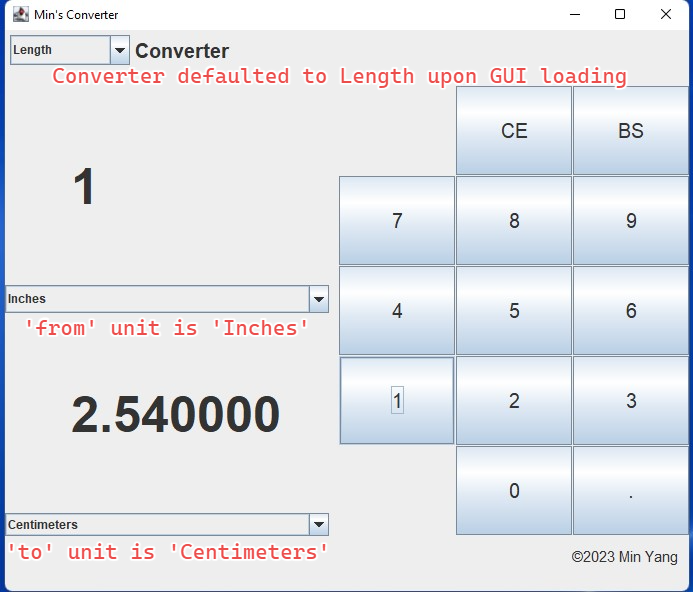
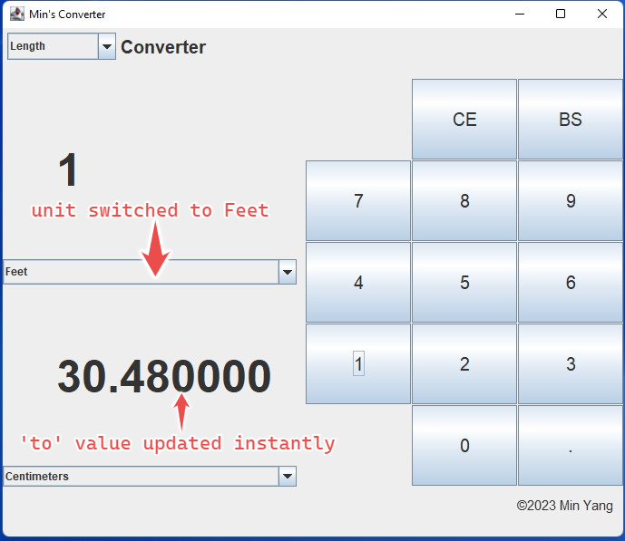
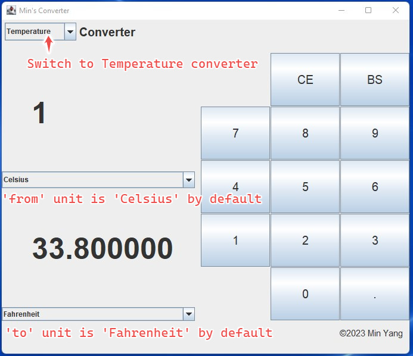
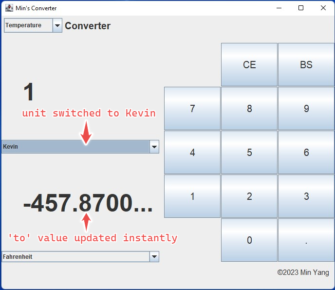
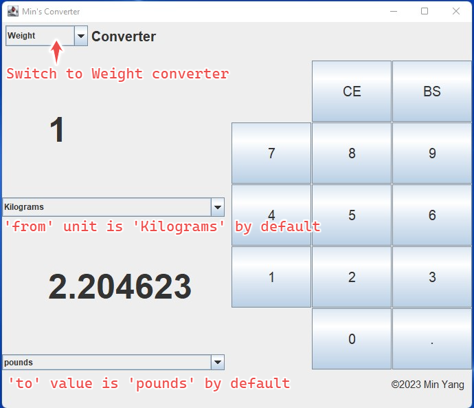
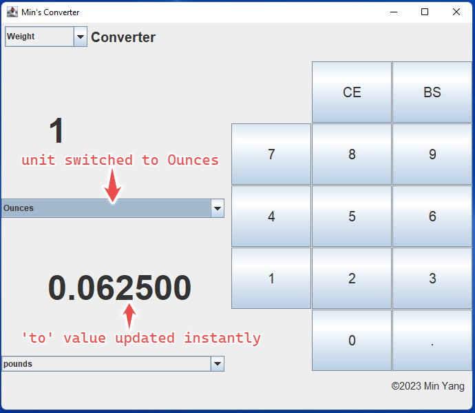

## Introduction
GUI desktop unit converter application built with Java Swing package. Presently it supports the conversion of length unit,
temperature unit and weight unit. The layout, operation and functionalities of the application resemble Windows 10 converter.
The converter data model is instantiated using the "Factory Design Pattern" where the concrete converter
is created by the factory worker method. a two-layer of hierarchy tree exists in the application. Abstract converter class serves as
a general converter and concrete classes (length, temperature, weight) inherit the abstract super class,
to implement the abstract method realizing conversion between a pair of units in different fields (length, temperature and weight, etc.)

## Layout of the GUI

The layout is composed of four panes: header pane where the converter type list is landed, display pane where 'from' & 'to' unit lists and values
are landed, button pane where the functioning buttons are landed, and the last footer pane where the author and the copyright info are displayed.

## Demo of unit lists

## Demo upon loading
When the GUI application is first loaded, the default converter user can see is the length converter, 'from' unit is defaulted to "Inches"
and 'to' unit is defaulted to "Centimeters". 'from value' is defaulted to 0. The user can change the 'from value' by clicking the buttons in the right pane and the 'to value' will be computed and displayed instantly.
The user can switch any intended unit pair in 'from' and 'to' unit list. The 'to' value will update automatically. See below picture:

## Demo when the user selects the 'Temperature' from the header drop-down type list
When the user selects 'Temperature' from the header drop-down type list, the working object behind the scene is changed to temperature converter.
The 'from' unit list and 'to' unit list changed to temperature units accordingly. 'from' unit list shows 'Celsius' and 'to' unit list shows
'Fahrenheit'. The user can change the 'from value' by clicking the buttons in the right pane and the 'to' value
will be computed and displayed instantly.
The user can switch any intended unit pair of 'from' and 'to' unit lists. The 'to value' will update automatically. See below picture:

## Demo when the user selects the 'Weight' from the header drop-down type list
Similarly, the working object behind the scene switched to weight converter. 'from' unit list shows 'Kilograms' and 'to' unit list shows
'pounds'. See below picture:

